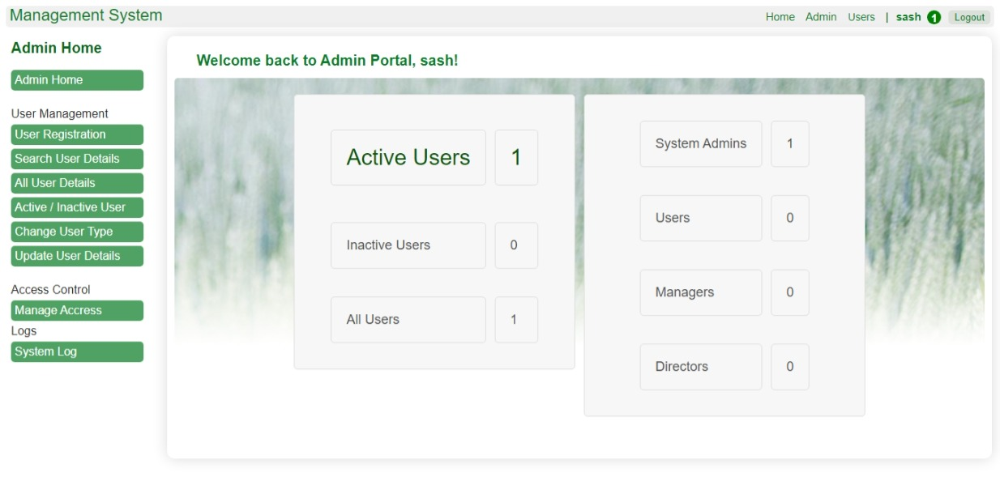

# Web-based-User-Authentication-Framework-(Core-PHP)
This repository contains a framework for a web-based Management System, developed using PHP. It provides a robust and scalable solution for managing various administrative tasks. The framework is designed to be user-friendly and easily customizable to fit different needs.

## Screenshot

  
 

## Setup Instructions

1. Please place the framework folder into the htdocs or httpdocs directory. 
2. Update the connection settings and SMTP details (necessary for the password recovery process) according to your preferences. 
3. Finally, import the MySQL database into your schema.
